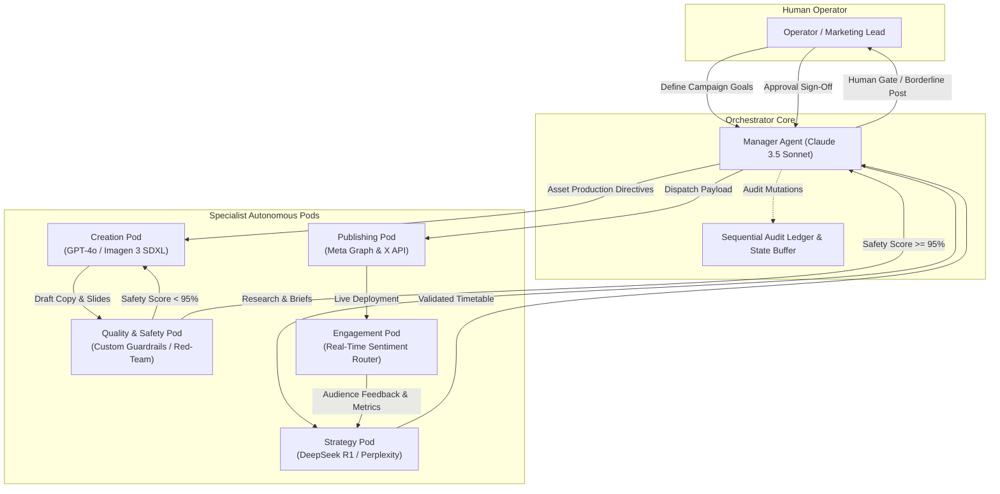

# Social Swarm — Autonomous AI Agent Social Media Operations

An enterprise-grade, manager-led multi-agent operations console for end-to-end social media publishing, strategy, and compliance. Powered by Next.js 15, TypeScript, and Tailwind CSS with a clean, warm Donezo-inspired visual design system.

---

## 📐 System Layout Wireframe

```text
+-----------------------------------------------------------------------------------------------------------------------+
|  PAGE BACKGROUND (#E4E5E7)                                                                                           |
|                                                                                                                       |
|  +-----------------------------------------------------------------------------------------------------------------+  |
|  |  FLOATING APPLICATION CONTAINER (rounded-[28px], bg-white, shadow-xl)                                           |  |
|  |                                                                                                                 |  |
|  |  +-----------------------+  +--------------------------------------------------------------------------------+  |  |
|  |  | SIDEBAR (w-56)        |  | TOP NAVBAR (h-[72px], sticky, border-b)                                        |  |  |
|  |  |                       |  | [Search directives, tasks... ⌘F]        [Mail] [Bell (Live)] [Totok Michael]   |  |  |
|  |  |  (●) Social Swarm     |  +--------------------------------------------------------------------------------+  |  |
|  |  |                       |  | MAIN CONTENT VIEWPORT (bg-[#f8f9fa], p-6, space-y-6)                           |  |  |
|  |  |  MENU                 |  |                                                                                |  |  |
|  |  |  [+] Dashboard        |  |  +--------------------------------------------------------------------------+  |  |  |
|  |  |  [ ] Campaigns (12+)  |  |  | PAGE HEADER                                                              |  |  |  |
|  |  |  [ ] Agent Pods (6)   |  |  | "Dashboard"                                 [+ Add Directive] [Export]   |  |  |  |
|  |  |  [ ] Approvals (4)    |  |  | Plan, prioritize & orchestrate autonomous social operations with ease...    |  |  |  |
|  |  |  [ ] Event Logs (Live)|  |  +--------------------------------------------------------------------------+  |  |  |
|  |  |  [ ] Analytics        |  |                                                                                |  |  |
|  |  |                       |  |  +--------------------------------------------------------------------------+  |  |  |
|  |  |  GENERAL              |  |  | 4 TOP METRIC CARDS ROW                                                   |  |  |  |
|  |  |  [ ] Settings         |  |  | +----------------+ +----------------+ +----------------+ +---------------+ |  |  |  |
|  |  |  [ ] Help             |  |  | | Total Campaign | | Completed Camp | | Active Campaign | | Pending Appr  | |  |  |  |
|  |  |  [ ] Logout           |  |  | | 24 (Hero Green)| | 10             | | 12             | | 4             | |  |  |  |
|  |  |                       |  |  | | [+18.4% MoM ↗] | | [+12% MoM    ↗]| | [In Flight   ↗]| | [Action Req ↗]| |  |  |  |
|  |  |  +-----------------+  |  |  | +----------------+ +----------------+ +----------------+ +---------------+ |  |  |  |
|  |  |  | SWARM CARD      |  |  |  +--------------------------------------------------------------------------+  |  |  |
|  |  |  | Autonomous Core |  |  |                                                                                |  |  |
|  |  |  | 6 Pods active   |  |  |  +--------------------------------------------------------------------------+  |  |  |
|  |  |  | [Live Console]  |  |  |  | MIDDLE 3-CARD ROW                                                         |  |  |  |
|  |  |  +-----------------+  |  |  | +--------------------------+ +--------------------+ +--------------------+ |  |  |  |
|  |  +-----------------------+  |  | | Weekly Content Output    | | Next Action        | | Recent Directives  | |  |  |  |
|  |                             |  | | (Capsule Bar Chart)      | | 14:30 EST Drop     | | [x] Slides Draft   | |  |  |  |
|  |                             |  | | [S][M][(74%)][W][T][F][S]| | 4 Carousel Slides   | | [x] Benchmark Scan | |  |  |  |
|  |                             |  | | Solid, Hatched & Peak    | | [ View Details ]   | | [ ] Guardrail Audit| |  |  |  |
|  |                             |  | +--------------------------+ +--------------------+ +--------------------+ |  |  |  |
|  |                             |  |  +--------------------------------------------------------------------------+  |  |  |
|  |                             |  |                                                                                |  |  |
|  |                             |  |  +--------------------------------------------------------------------------+  |  |  |
|  |                             |  |  | BOTTOM 3-CARD ROW                                                         |  |  |  |
|  |                             |  |  | +--------------------------+ +--------------------+ +--------------------+ |  |  |  |
|  |                             |  |  | | Specialist Agent Pods    | | Campaign Velocity  | | Swarm Orchestrator | |  |  |  |
|  |                             |  |  | | - Manager   Orchestrating| |       ( 57.1% )    | | 01:24:08 (Uptime)  | |  |  |  |
|  |                             |  |  | | - Strategy     Analyzing | |    Semi-circle Arc | | 6 Pods Live Loop   | |  |  |  |
|  |                             |  |  | | - Creation    Generating | |  Dispatched (48%)  | |                    | |  |  |  |
|  |                             |  |  | | - Quality      Reviewing | |  Staged     (20%)  | | [ || Pause Swarm ] | |  |  |  |
|  |                             |  |  | | - Publishing     Standby | |  Remaining  (32%)  | | [ (R) Sync Telemetry | |  |  |
|  |                             |  |  | | - Engagement   Listening | |                    | |                    | |  |  |  |
|  |                             |  |  | +--------------------------+ +--------------------+ +--------------------+ |  |  |  |
|  |                             |  |  +--------------------------------------------------------------------------+  |  |  |
|  |                             |  +--------------------------------------------------------------------------------+  |  |
|  |                             +-----------------------------------------------------------------------------------+  |  |
|  +-----------------------------------------------------------------------------------------------------------------+  |
+-----------------------------------------------------------------------------------------------------------------------+
```

---

## 📋 Dedicated Event Logs & Sequential Audit Wireframe (`/logs`)

```text
+-----------------------------------------------------------------------------------------------------------------------+
|  EVENT LOGS & SEQUENTIAL AUDIT ROUTE (/logs)                                                                          |
|                                                                                                                       |
|  HEADER:                                                                                                              |
|  "Event Logs & Audit"  [Live Stream Badge]                         [ < Back to Dashboard ]  [ Download Export ]       |
|  Deterministic audit ledger of multi-agent state mutations, directives, and approvals...                             |
|                                                                                                                       |
|  AUDIT METRICS SUMMARY CARDS:                                                                                         |
|  +---------------------+ +----------------------+ +----------------------+ +----------------------------------+       |
|  | Total Mutations     | | Audit Verification   | | Pending Operator     | | Active Agent Pods                |       |
|  | 1,482               | | 99.8%                | | 4                    | | 6 / 6                            |       |
|  | +68 in last 24h     | | Zero schema failures | | Action required      | | All telemetry validated          |       |
|  +---------------------+ +----------------------+ +----------------------+ +----------------------------------+       |
|                                                                                                                       |
|  EVENT LOG CARD & FILTER TOOLBAR:                                                                                     |
|  +-----------------------------------------------------------------------------------------------------------------+  |
|  | Manager Event Log & Sequential Audit                                                                            |  |
|  | [ Search events, pods, IDs... ]            [ All Pods v ]            [ All Statuses v ]                        |  |
|  +-----------------------------------------------------------------------------------------------------------------+  |
|  | STATUS            | EVENT & DIRECTIVES               | AGENT POD       | INITIATED BY      | TIMESTAMP      |  |
|  |-------------------|----------------------------------|-----------------|-------------------|----------------|  |
|  | (• Pending Appr)  | High-Impact Carousel Stage Deck  | [•] Creation    | Agent-Creation-02 | 14:22:18 EST   |  |
|  | (• Complete)      | Payload Dispatched: Tech Thread  | [•] Publishing  | Agent-Publish-01  | 14:15:02 EST   |  |
|  | (• Safety Cleared)| Multi-Modal Brand Safety Audit   | [•] Quality     | Agent-Audit-03    | 14:08:44 EST   |  |
|  | (• Auto-Approved) | Real-Time Audience Triage (412)  | [•] Engagement  | Agent-Interact-01 | 13:58:19 EST   |  |
|  | (• In Progress)   | Cross-Network Viral Optimization | [•] Strategy    | Agent-Strategy-01 | 13:42:10 EST   |  |
|  +-----------------------------------------------------------------------------------------------------------------+  |
|  | Showing 5 active events • Continuous audit stream                                          [ Prev ] 1 / 3 [ Next ] |  |
|  +-----------------------------------------------------------------------------------------------------------------+  |
|                                                                                                                       |
|  INTERACTIVE AUDIT MODAL INSPECTOR (On Row Click):                                                                    |
|  +---------------------------------------------------------------------------------+                                  |
|  |  EVT-1094: High-Impact Carousel Stage Deck                                  [X] |                                  |
|  |  Directive Details: Creation Pod completed 4 slides with Imagen 3. Safety 98.4% |                                  |
|  |  +-----------------------------------+ +-------------------------------------+  |                                  |
|  |  | Agent Pod: Creation Pod            | | Initiated By: Agent-Creation-02     |  |                                  |
|  |  | Status: Pending Approval          | | Timestamp: 14:22:18 EST             |  |                                  |
|  |  +-----------------------------------+ +-------------------------------------+  |                                  |
|  |                                                              [ Close Detail ]   |                                  |
|  +---------------------------------------------------------------------------------+                                  |
+-----------------------------------------------------------------------------------------------------------------------+
```

---

## 🔄 Multi-Agent Orchestration Flow (Mermaid)



---

## 🗂️ Project Directory Structure

```text
Social-Media-Agent/
├── netlify.toml                      # One-click Netlify build & runtime configuration
├── vercel.json                       # Zero-config Vercel deployment profile
├── .npmrc                            # Dependency resolution config (legacy-peer-deps)
├── next.config.mjs                   # Next.js 15 application config
├── tailwind.config.ts                # Custom Donezo color palettes & radius tokens
├── package.json                      # Project scripts & dependencies
└── src/
    ├── app/
    │   ├── layout.tsx                # Floating rounded outer card shell & sidebar provider
    │   ├── globals.css               # Clean typography, custom scrollbars & reset
    │   ├── page.tsx                  # Main Donezo-styled Social Swarm Dashboard
    │   ├── logs/
    │   │   └── page.tsx              # Dedicated Manager Event Log & Sequential Audit
    │   ├── calendar/
    │   │   └── page.tsx              # Autonomous Content Calendar timetable
    │   ├── pipeline/
    │   │   └── page.tsx              # Multi-agent visual step-by-step pipeline
    │   ├── approvals/
    │   │   └── page.tsx              # Human-in-the-loop review & approval gates
    │   └── analytics/
    │       └── page.tsx              # Cross-platform performance & viral latency metrics
    ├── components/
    │   ├── shared/
    │   │   ├── Sidebar.tsx           # Donezo fixed/absolute sidebar with navigation
    │   │   └── Navbar.tsx            # Clean sticky search bar, alerts, and user profile
    │   └── ui/                       # Atom design system components
    └── context/
        └── SidebarContext.tsx        # Responsive mobile drawer state
```

---

## 🚀 Getting Started

### 1. Local Development
```bash
# Install dependencies
npm install

# Run dev server
npm run dev
```
Open **http://localhost:3000** to view the live dashboard.

### 2. Production Build
```bash
npm run build
npm start
```

### 3. Deploy to Netlify or Vercel
Connect your GitHub repository:
- **`netlify.toml`** is already configured for automatic production builds.
- **`vercel.json`** is configured for instant Vercel zero-config deployments.